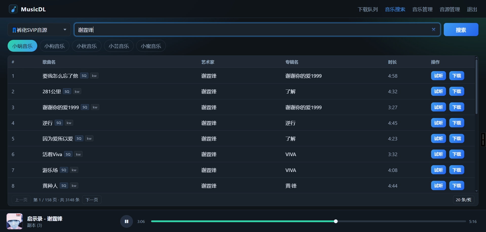
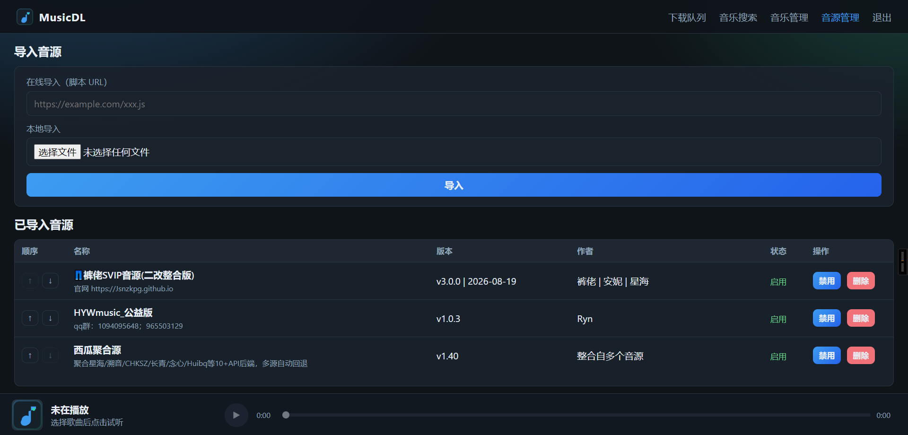
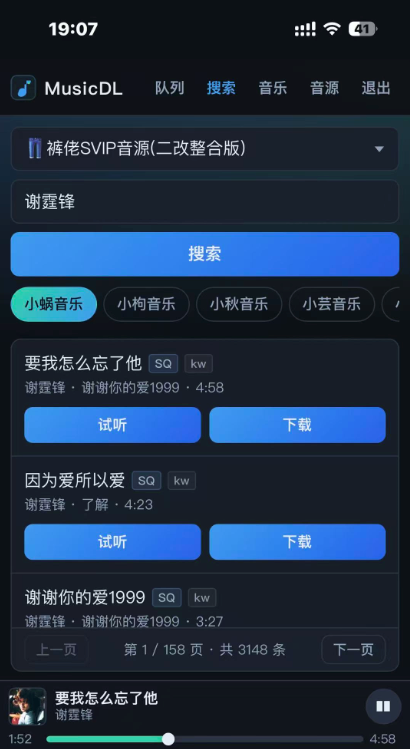
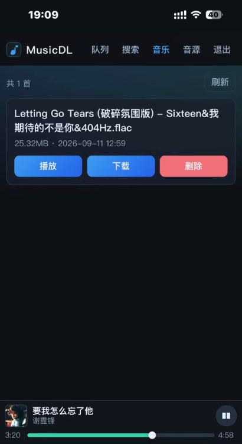

# MusicDL

基于洛雪（LX Music）自定义音源的本地 Web 工具，用来**搜索、试听、下载**音乐。

主要用途：对接 [Navidrome](https://www.navidrome.org/)（或其它扫盘媒体库）——在本工具里搜歌下载到本地目录，再由 Navidrome 扫描入库播放。当你在听到喜欢音乐的时候，可以随时随地下载到私人音乐库中归档收藏。

## 截图

搜索与试听 / 下载：



音源管理：



手机端 · 搜索：



手机端 · 音乐管理：



## 功能

- 导入洛雪兼容自定义音源（URL 或本地 `.js`）
- 按平台搜索（酷我 / 酷狗 / QQ / 网易云 / 咪咕），输入时可联想提示
- 试听、按音质下载；下载队列；MP3/FLAC 可写入封面与歌词
- 音乐管理：本地已下载列表、播放与删除
- 手机端界面适配（搜索、音乐管理等）
- 下载文件落在 `data/downloads/`，便于挂载给 Navidrome

## 要求

- Node.js ≥ 22
- 或 Docker

## 本地运行

```bash
npm install
npm start
```

打开 http://127.0.0.1:8000

开发热重载：`npm run dev`

### 访问密码（可选）

局域网或公网暴露时，可加单密码门禁：

```bash
# Windows PowerShell
$env:AUTH_PASSWORD="你的密码"
$env:HOST="0.0.0.0"
npm start
```

```bash
# Linux / macOS
AUTH_PASSWORD='你的密码' HOST=0.0.0.0 npm start
```

- 未设置 `AUTH_PASSWORD` 时不启用登录（适合本机使用）
- 登录态为 HttpOnly cookie，默认约 7 天

## Docker

直接使用已构建镜像：

```bash
docker compose up -d
```

或：

```bash
docker run -d --name musicdl \
  -p 8000:8000 \
  -v ./data:/app/data \
  ghcr.io/fightroad/musicdl:latest
```

需要密码时加上 `-e AUTH_PASSWORD=你的密码`（compose 可在 `environment` 中配置）。

打开 http://127.0.0.1:8000 。数据在 `./data`（音源配置与下载）。

本地改代码构建：

```bash
docker build -t musicdl:local .
docker run -d -p 8000:8000 -v ./data:/app/data musicdl:local
```

## 使用

1. 打开「音源管理」，导入洛雪脚本（在线 URL 或本地 `.js`）
2. 选择音源与平台，搜索歌曲（可点选联想词）
3. 试听或下载；播放地址由音源脚本的 `musicUrl` 解析
4. 在「音乐管理」查看、播放或删除已下载文件

### 对接 Navidrome

1. 将 MusicDL 的下载目录指向 Navidrome 能扫到的库路径（本机可直接用 `data/downloads`，Docker 可挂同一卷）
2. 在 MusicDL 中搜索并下载
3. 在 Navidrome 触发库扫描（或等待自动扫描）
4. 即可在 Navidrome 中播放

## 说明

- 搜索、联想与歌词由本工具内置；取链依赖你导入的洛雪音源脚本
- 部分仅适配 LX 桌面（Electron）环境的音源，可能无法在本工具中取链
- 音源配置保存在 `data/config/sources.json`
- 仅监听本机时默认 `127.0.0.1`；容器内默认 `HOST=0.0.0.0`
- 可选 `AUTH_PASSWORD` 开启单密码登录（见上文）
